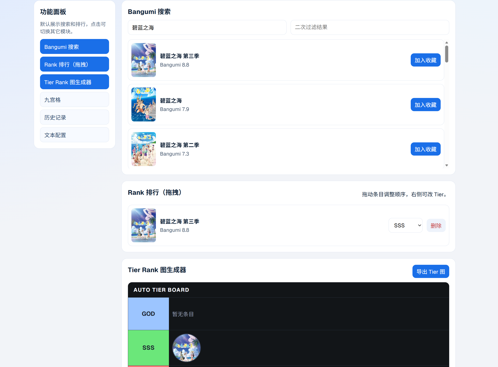
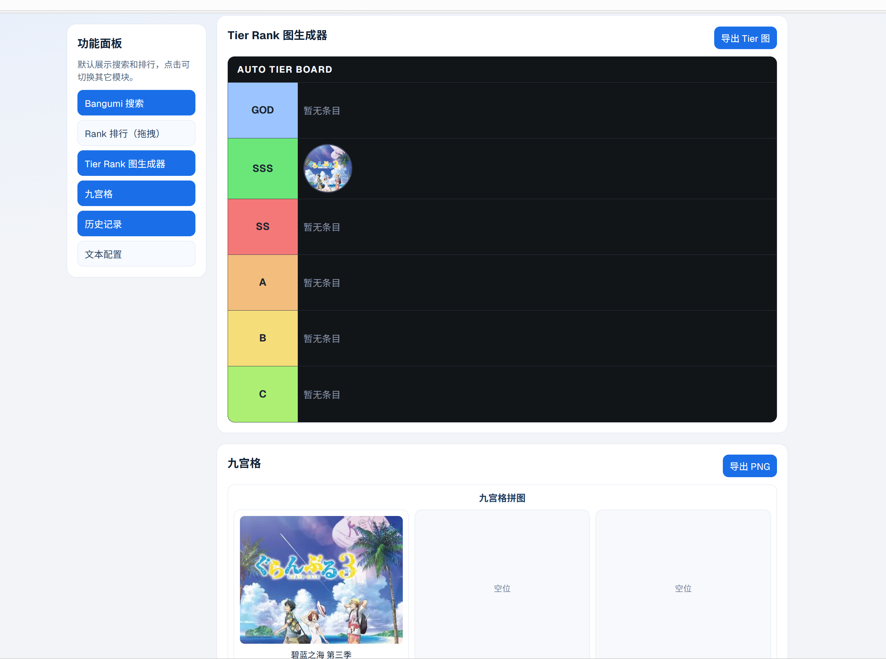
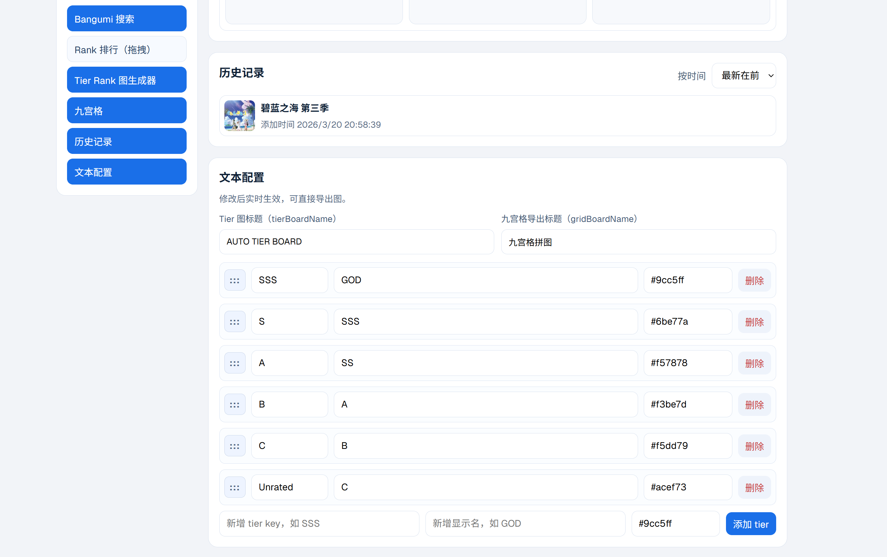

# auto-memories-doll

跨端动漫管理应用（Web + Mobile），核心功能：

- Bangumi 搜索
- 个人收藏列表
- Rank 拖拽排序 + Tier（S/A/B/C/Unrated）
- 九宫格生成与排序
- Web 端九宫格导出 PNG

| 效果图                                  | 效果图                                  |
| --------------------------------------- | --------------------------------------- |
|  |  |
|  |  |

## 前端完全由ai生成

一句话自动生成设计图，设计方案，用ai把图和方案解析为codex提示词，喂给codex，全程allow后生成代码库。

生成后手动调优接口，后端由本人独立编写，使用pg数据库，闭源开发。

给ai大人跪了，甚至自动知道调用bangumi的api，而且调用逻辑完成正确，我的天，甚至甚至包括这个md文件都是ai执笔😲


## Monorepo 结构

```text
apps/
 web/      Next.js Web
 mobile/   Expo React Native
 docs/     文档站（保留）

packages/
 anime-core/  共享类型、store、算法、Bangumi 请求
 ui/          共享 UI 示例组件
```

## 快速启动

```bash
npm install
```

启动 Web：

```bash
npm run dev --workspace=web
```

启动 Mobile（Expo）：

```bash
npm run dev --workspace=mobile
```

## 校验命令

```bash
npm run check-types --workspace=web
npm run check-types --workspace=mobile
npm run check-types --workspace=@repo/anime-core
```

## 已实现的共享策略

- 共享：类型定义、Bangumi 请求封装、Tier 规则、九宫格算法、Zustand store
- 端差异：渲染层和交互层（Web 使用 dnd-kit，Mobile 使用 react-native-draggable-flatlist）

## 关键文件

- `apps/web/app/sections/anime-dashboard.tsx`
- `apps/web/app/config/dashboard-config.ts`
- `apps/web/app/api/anime/route.ts`
- `apps/mobile/App.tsx`
- `packages/anime-core/src/store.ts`
- `packages/anime-core/src/rank.ts`
- `packages/anime-core/src/grid.ts`
